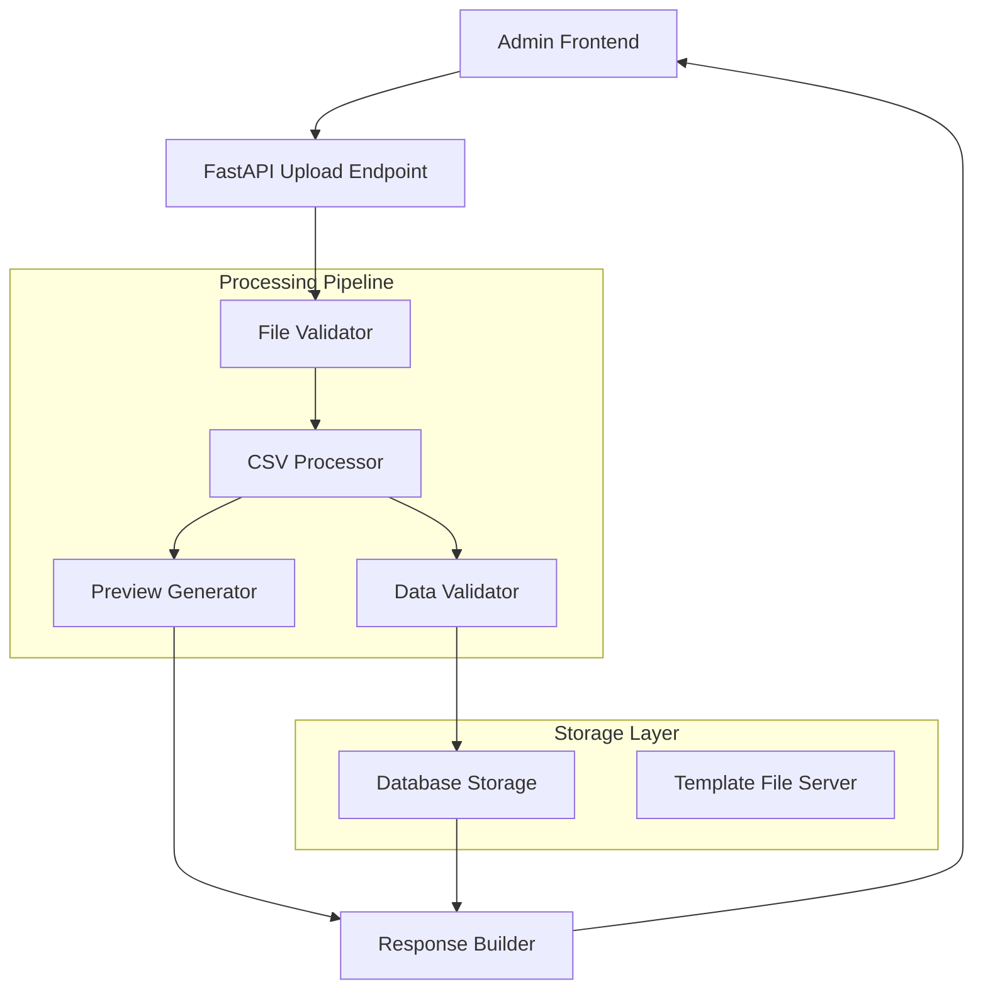

# Design Document: CSV File Upload Processing

## Overview

This design document outlines the implementation of real CSV file upload functionality to replace the current mock implementation in the express tracking website's admin backend. The system will process CSV and Excel files containing manifest data, validate the content against business rules, and provide both preview and save modes for data processing.

The solution leverages pandas for robust CSV/Excel processing, implements comprehensive validation logic, and maintains the existing FastAPI endpoint structure while replacing mock responses with real data processing capabilities.

## Architecture

### High-Level Architecture



### Component Interaction Flow

1. **File Upload**: Admin user uploads CSV/Excel file through existing frontend
2. **File Validation**: System validates file format, size, and basic structure
3. **Data Processing**: CSV processor parses file content using pandas
4. **Data Validation**: Each row is validated against business rules
5. **Mode Handling**: System processes data based on preview_only parameter
6. **Response Generation**: Results are formatted and returned to frontend

## Components and Interfaces

### 1. File Validator Component

**Purpose**: Validates uploaded files before processing

**Interface**:
```python
class FileValidator:
    def validate_file_format(self, filename: str) -> bool
    def validate_file_size(self, file_content: bytes) -> bool
    def validate_file_structure(self, file_content: bytes) -> ValidationResult
```

**Responsibilities**:
- Check file extension (.csv, .xlsx, .xls)
- Validate file size (max 10MB)
- Verify file is not corrupted
- Ensure file contains readable data

### 2. CSV Processor Component

**Purpose**: Core component for parsing and processing CSV/Excel files

**Interface**:
```python
class CSVProcessor:
    def process_file(self, file_content: bytes, filename: str, preview_only: bool) -> ProcessingResult
    def parse_csv(self, file_content: bytes) -> pd.DataFrame
    def parse_excel(self, file_content: bytes) -> pd.DataFrame
    def normalize_columns(self, df: pd.DataFrame) -> pd.DataFrame
```

**Key Features**:
- Uses pandas for robust file parsing
- Handles both CSV and Excel formats
- Supports UTF-8 encoding for Chinese characters
- Normalizes column names to match template format
- Implements streaming processing for large files

### 3. Data Validator Component

**Purpose**: Validates individual rows and fields against business rules

**Interface**:
```python
class DataValidator:
    def validate_row(self, row_data: dict, row_number: int) -> RowValidationResult
    def validate_required_fields(self, row_data: dict) -> List[str]
    def validate_data_types(self, row_data: dict) -> List[str]
    def validate_business_rules(self, row_data: dict) -> List[str]
```

**Validation Rules**:
- Required fields: 快递单号, 理货日期, 运输代码, 客户代码, 货物代码
- Numeric validation: 长度, 宽度, 高度, 重量 (positive numbers)
- Date validation: 理货日期 (recognizable date format)
- String validation: 快递单号 (alphanumeric characters)
- Duplicate detection: Check for duplicate tracking numbers

### 4. Database Storage Component

**Purpose**: Handles data persistence operations

**Interface**:
```python
class ManifestStorage:
    def save_manifest_records(self, records: List[ManifestRecord]) -> StorageResult
    def check_duplicate_tracking_numbers(self, tracking_numbers: List[str]) -> List[str]
    def update_existing_records(self, records: List[ManifestRecord]) -> int
    def insert_new_records(self, records: List[ManifestRecord]) -> int
```

**Features**:
- Batch insert operations for performance
- Duplicate handling (update existing records)
- Transaction support for data integrity
- Timestamp management (created_at, updated_at)

### 5. Template File Server Component

**Purpose**: Serves CSV template file for downloads

**Interface**:
```python
class TemplateServer:
    def serve_template(self) -> FileResponse
    def get_template_path(self) -> str
```

## Data Models

### ManifestRecord Model

```python
@dataclass
class ManifestRecord:
    tracking_number: str
    package_number: Optional[str]
    manifest_date: Optional[str]
    length: Optional[float]
    width: Optional[float]
    height: Optional[float]
    weight: Optional[float]
    goods_code: str
    customer_code: str
    transport_code: str
    created_at: Optional[datetime] = None
    updated_at: Optional[datetime] = None
```

### Processing Result Models

```python
@dataclass
class ProcessingResult:
    success: bool
    statistics: ProcessingStatistics
    preview_data: List[PreviewRow]
    errors: List[str]

@dataclass
class ProcessingStatistics:
    total_rows: int
    valid_rows: int
    invalid_rows: int
    inserted: int
    updated: int
    skipped: int

@dataclass
class PreviewRow:
    row_number: int
    data: dict
    valid: bool
    errors: List[str]
```

### Validation Result Models

```python
@dataclass
class ValidationResult:
    is_valid: bool
    errors: List[str]

@dataclass
class RowValidationResult:
    row_number: int
    is_valid: bool
    errors: List[str]
    data: dict
```

## Implementation Details

### File Processing Pipeline

1. **File Reception**:
   - Receive UploadFile from FastAPI
   - Read file content into memory (with size limit)
   - Extract filename and determine file type

2. **File Validation**:
   - Check file extension against allowed types
   - Validate file size (max 10MB)
   - Perform basic corruption checks

3. **Data Parsing**:
   - Use pandas.read_csv() for CSV files
   - Use pandas.read_excel() for Excel files
   - Handle encoding issues (UTF-8 support)
   - Normalize column names to match template

4. **Data Validation**:
   - Iterate through each row
   - Apply validation rules per field
   - Collect errors with specific row numbers
   - Continue processing valid rows

5. **Mode-Specific Processing**:
   - **Preview Mode**: Return sample data with validation status
   - **Save Mode**: Persist valid records to database

6. **Response Generation**:
   - Compile processing statistics
   - Format preview data (if applicable)
   - Return structured JSON response

### Error Handling Strategy

**File-Level Errors**:
- Invalid file format → HTTP 400 with descriptive message
- File too large → HTTP 400 with size limit message
- Corrupted file → HTTP 400 with corruption message

**Row-Level Errors**:
- Continue processing other rows
- Collect specific error messages per row
- Include row numbers in error reports
- Distinguish between validation types (required, format, business rules)

**System-Level Errors**:
- Database connection issues → HTTP 500 with generic message
- Memory issues → HTTP 500 with resource message
- Unexpected exceptions → HTTP 500 with logged details

### Performance Optimizations

**Memory Management**:
- Stream large files instead of loading entirely into memory
- Process data in chunks for very large files
- Use pandas chunking capabilities for Excel files

**Database Operations**:
- Use batch inserts for multiple records
- Implement connection pooling
- Use transactions for data consistency
- Index tracking_number field for duplicate checks

**Processing Efficiency**:
- Validate data types using pandas built-in functions
- Use vectorized operations where possible
- Cache validation results for repeated patterns

## Correctness Properties

*A property is a characteristic or behavior that should hold true across all valid executions of a system-essentially, a formal statement about what the system should do. Properties serve as the bridge between human-readable specifications and machine-verifiable correctness guarantees.*

Based on the prework analysis and property reflection, the following properties capture the essential correctness requirements:

**Property 1: File Format Processing**
*For any* valid CSV or Excel file with the template format, the CSV_Processor should successfully parse it and extract the data into the expected structure
**Validates: Requirements 1.1, 1.2**

**Property 2: File Validation Rejection**
*For any* file with unsupported format or exceeding 10MB size, the File_Validator should reject it with appropriate error messages
**Validates: Requirements 1.3, 1.4**

**Property 3: UTF-8 Encoding Support**
*For any* CSV file containing Chinese characters in headers or data, the CSV_Processor should process it correctly without encoding errors
**Validates: Requirements 1.5**

**Property 4: Comprehensive Data Validation**
*For any* CSV row, the CSV_Processor should validate all required fields, numeric constraints, date formats, and string patterns, flagging invalid rows with specific error messages
**Validates: Requirements 2.1, 2.2, 2.3, 2.4, 2.5**

**Property 5: Error Resilience**
*For any* file containing both valid and invalid rows, the CSV_Processor should continue processing valid rows and provide detailed error reporting for invalid ones
**Validates: Requirements 2.6, 4.2, 4.3**

**Property 6: Preview Mode Isolation**
*For any* file processed with preview_only=true, the CSV_Processor should validate and return preview data without making any changes to the database
**Validates: Requirements 3.1, 3.3**

**Property 7: Save Mode Persistence**
*For any* file processed with preview_only=false, the CSV_Processor should validate, process, and persist valid records to storage while returning processing statistics
**Validates: Requirements 3.2, 3.4**

**Property 8: Mode Consistency**
*For any* file processed in both preview and save modes, the validation results should be identical between the two modes
**Validates: Requirements 3.5**

**Property 9: Statistics Accuracy**
*For any* processed file, the returned statistics (total_rows, valid_rows, invalid_rows, skipped) should accurately reflect the actual processing results
**Validates: Requirements 4.1**

**Property 10: Duplicate Detection**
*For any* file containing duplicate tracking numbers, the CSV_Processor should detect and report them as validation errors
**Validates: Requirements 4.4**

**Property 11: Error Categorization**
*For any* validation error, the CSV_Processor should distinguish between data format errors and business rule violations in error messages
**Validates: Requirements 4.5**

**Property 12: Authentication Enforcement**
*For any* request to the upload endpoint, the Admin_Backend should require valid Bearer token authentication and return 401 for invalid tokens
**Validates: Requirements 6.1, 6.2**

**Property 13: Security Validation**
*For any* uploaded file, the Admin_Backend should validate file content before processing to prevent malicious uploads
**Validates: Requirements 6.5**

**Property 14: Audit Logging**
*For any* file processing operation, the Admin_Backend should log the operation with username, filename, and any system errors that occur
**Validates: Requirements 6.3, 6.4**

**Property 15: Data Persistence with Timestamps**
*For any* valid manifest records in save mode, the CSV_Processor should store them to the database with proper created_at and updated_at timestamps
**Validates: Requirements 7.1, 7.2**

**Property 16: Duplicate Handling**
*For any* tracking number that already exists in the database, the CSV_Processor should update the existing record with new data
**Validates: Requirements 7.3**

**Property 17: Storage Error Resilience**
*For any* batch of records where some fail to store, the CSV_Processor should continue processing the remaining records
**Validates: Requirements 7.4**

**Property 18: Performance Compliance**
*For any* file up to 10MB in size, the CSV_Processor should complete processing within 30 seconds
**Validates: Requirements 8.1**

**Property 19: Concurrency Safety**
*For any* concurrent upload requests from multiple users, the Admin_Backend should handle them without data corruption
**Validates: Requirements 8.3**

Now I need to analyze the acceptance criteria to create correctness properties. Let me use the prework tool:

<function_calls>
<invoke name="prework">
<parameter name="featureName">csv-file-upload

## Error Handling

### Error Classification

**File-Level Errors** (HTTP 400):
- Unsupported file format (not .csv, .xlsx, .xls)
- File size exceeds 10MB limit
- File corruption or unreadable content
- Missing required columns in template format

**Authentication Errors** (HTTP 401):
- Missing Bearer token
- Invalid or expired token
- Insufficient permissions

**Validation Errors** (HTTP 200 with error details):
- Invalid data in specific rows
- Missing required fields
- Invalid data types or formats
- Business rule violations
- Duplicate tracking numbers

**System Errors** (HTTP 500):
- Database connection failures
- Memory exhaustion
- Unexpected processing exceptions
- File system access issues

### Error Response Format

```json
{
  "success": false,
  "message": "Error description",
  "errors": ["Specific error messages"],
  "statistics": {
    "total_rows": 0,
    "valid_rows": 0,
    "invalid_rows": 0,
    "inserted": 0,
    "updated": 0,
    "skipped": 0
  }
}
```

### Error Recovery Strategies

1. **Partial Processing**: Continue processing valid rows when some rows have errors
2. **Transaction Rollback**: Rollback database changes if critical errors occur
3. **Graceful Degradation**: Return partial results with error details
4. **Retry Logic**: Implement retry for transient database errors
5. **Resource Cleanup**: Ensure temporary files and connections are cleaned up

## Testing Strategy

### Dual Testing Approach

The testing strategy employs both unit tests and property-based tests to ensure comprehensive coverage:

**Unit Tests**: Focus on specific examples, edge cases, and integration points
- File format validation with specific file types
- Authentication with known valid/invalid tokens
- Database operations with mock data
- Error handling with simulated failures
- Template serving functionality

**Property-Based Tests**: Verify universal properties across all inputs
- File processing with randomly generated CSV/Excel files
- Data validation with randomly generated row data
- Mode consistency with the same file processed in both modes
- Performance testing with files of varying sizes
- Concurrency testing with multiple simultaneous uploads

### Property-Based Testing Configuration

**Library Selection**: Use Hypothesis for Python property-based testing
- Minimum 100 iterations per property test
- Custom generators for CSV data, file formats, and manifest records
- Shrinking capabilities to find minimal failing examples

**Test Tagging**: Each property test references its design document property
- Tag format: **Feature: csv-file-upload, Property {number}: {property_text}**
- Example: **Feature: csv-file-upload, Property 1: File Format Processing**

### Test Data Generation

**CSV File Generators**:
- Valid CSV files with template format and random data
- Invalid CSV files with missing columns, wrong formats
- Files with Chinese characters for UTF-8 testing
- Files of various sizes up to and exceeding 10MB limit

**Excel File Generators**:
- Valid Excel files (.xlsx, .xls) with template format
- Excel files with multiple sheets (test first sheet processing)
- Corrupted Excel files for error handling testing

**Row Data Generators**:
- Valid manifest records with all required fields
- Invalid records with missing required fields
- Records with invalid data types (strings in numeric fields)
- Records with invalid date formats
- Records with special characters in tracking numbers

### Integration Testing

**End-to-End Scenarios**:
- Complete upload workflow from frontend to database
- Authentication flow with real tokens
- File processing with actual database operations
- Error scenarios with real error responses

**Performance Testing**:
- Large file processing (up to 10MB)
- Concurrent upload scenarios
- Memory usage monitoring
- Processing time measurements

### Test Environment Setup

**Database**: Use test database with same schema as production
**File Storage**: Use temporary directories for test files
**Authentication**: Mock authentication service or use test tokens
**Logging**: Capture and verify log messages during tests

This comprehensive testing strategy ensures that both specific scenarios and general properties are validated, providing confidence in the system's correctness and robustness.