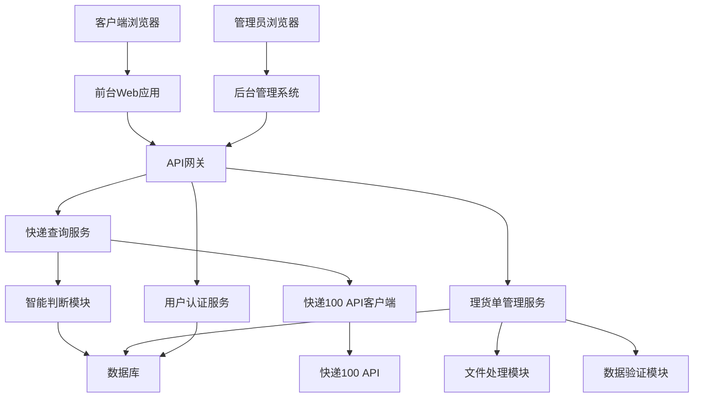
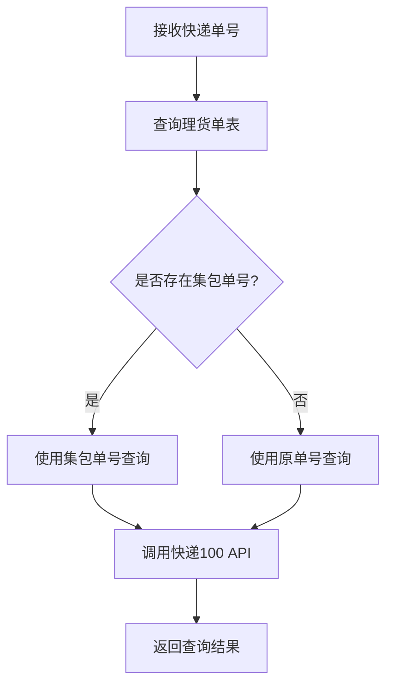

# 快递查询网站设计文档

## 概述

快递查询网站是一个综合性的快递管理和查询系统，采用前后端分离的架构设计。系统包含面向客户的前台查询功能和面向管理员的后台管理功能。前台提供无需登录的快递单号查询服务，后台提供理货单数据管理功能。系统通过智能判断逻辑，根据快递单号是否存在集包单号关联来决定查询策略，并通过快递100 API获取实时的快递信息。

## 架构

### 系统架构图



### 技术栈选择

- **前端**: HTML5, CSS3, JavaScript (ES6+), Bootstrap 5
- **后端**: Node.js + Express.js 或 Python + FastAPI
- **数据库**: MySQL 8.0 或 PostgreSQL
- **文件处理**: Multer (Node.js) 或 pandas (Python)
- **API客户端**: Axios 或 requests
- **认证**: JWT (JSON Web Tokens)

## 组件和接口

### 前台查询系统

#### 查询页面组件
- **TrackingForm**: 快递单号输入表单
- **LoadingIndicator**: 查询状态指示器  
- **TrackingResult**: 查询结果展示组件
- **ErrorMessage**: 错误信息显示组件

#### 查询流程接口
```javascript
// 快递查询API接口
POST /api/tracking/query
{
  "trackingNumber": "string"
}

// 响应格式
{
  "success": boolean,
  "data": {
    "trackingNumber": "string",
    "company": "string", 
    "status": "string",
    "tracks": [
      {
        "time": "datetime",
        "location": "string",
        "description": "string"
      }
    ]
  },
  "message": "string"
}
```

### 后台管理系统

#### 认证组件
- **LoginForm**: 管理员登录表单
- **AuthGuard**: 路由权限守卫
- **SessionManager**: 会话管理器

#### 理货单管理组件  
- **FileUpload**: 文件上传组件
- **DataPreview**: 数据预览表格
- **ManifestList**: 理货单列表
- **ManifestEditor**: 理货单编辑器

#### 管理接口
```javascript
// 登录接口
POST /api/admin/login
{
  "username": "string",
  "password": "string"
}

// 文件上传接口
POST /api/admin/manifest/upload
Content-Type: multipart/form-data

// 理货单查询接口
GET /api/admin/manifest?page=1&limit=20&search=keyword

// 理货单更新接口
PUT /api/admin/manifest/:id
{
  "trackingNumber": "string",
  "manifestDate": "date",
  "transportCode": "string",
  "customerCode": "string", 
  "goodsCode": "string",
  "packageNumber": "string",
  "weight": "number",
  "dimensions": "string",
  "specialFee": "number"
}
```

## 数据模型

### 理货单表 (cargo_manifest)
```sql
CREATE TABLE cargo_manifest (
  id BIGINT PRIMARY KEY AUTO_INCREMENT,
  tracking_number VARCHAR(50) NOT NULL UNIQUE,
  manifest_date DATE NOT NULL,
  transport_code VARCHAR(20) NOT NULL,
  customer_code VARCHAR(20) NOT NULL,
  goods_code VARCHAR(20) NOT NULL,
  package_number VARCHAR(50),
  weight DECIMAL(10,3),
  length DECIMAL(8,2),
  width DECIMAL(8,2), 
  height DECIMAL(8,2),
  special_fee DECIMAL(10,2),
  created_at TIMESTAMP DEFAULT CURRENT_TIMESTAMP,
  updated_at TIMESTAMP DEFAULT CURRENT_TIMESTAMP ON UPDATE CURRENT_TIMESTAMP,
  INDEX idx_tracking_number (tracking_number),
  INDEX idx_package_number (package_number)
);
```

### 管理员表 (admin_users)
```sql
CREATE TABLE admin_users (
  id INT PRIMARY KEY AUTO_INCREMENT,
  username VARCHAR(50) NOT NULL UNIQUE,
  password_hash VARCHAR(255) NOT NULL,
  created_at TIMESTAMP DEFAULT CURRENT_TIMESTAMP,
  last_login TIMESTAMP NULL
);
```

### API配置表 (api_config)
```sql
CREATE TABLE api_config (
  id INT PRIMARY KEY AUTO_INCREMENT,
  config_key VARCHAR(50) NOT NULL UNIQUE,
  config_value VARCHAR(255) NOT NULL,
  description TEXT,
  created_at TIMESTAMP DEFAULT CURRENT_TIMESTAMP,
  updated_at TIMESTAMP DEFAULT CURRENT_TIMESTAMP ON UPDATE CURRENT_TIMESTAMP
);
```
### 快递100 API配置

#### API认证参数
- **授权key**: fypLxFrg3636 (智能判断功能)
- **customer**: 3564B6CF145FA93724CE18C1FB149036
- **secret**: 8fa1052ba57e4d9ca0427938a77e2e30
- **userid**: a1ffc21f3de94cf5bdd908faf3bbc81d

#### API接口规范
```javascript
// 快递100查询接口
POST https://poll.kuaidi100.com/poll/query.do
Content-Type: application/x-www-form-urlencoded

// 请求参数
{
  "customer": "3564B6CF145FA93724CE18C1FB149036",
  "sign": "MD5签名",
  "param": JSON.stringify({
    "com": "快递公司编码",
    "num": "快递单号", 
    "phone": "手机号后四位(可选)"
  })
}

// 签名生成算法
sign = MD5(param + key + customer).toUpperCase()
```

## 核心业务逻辑

### 智能判断模块

#### 查询决策流程


#### 智能判断实现
```javascript
class IntelligentQuery {
  async queryTracking(trackingNumber) {
    // 1. 查询理货单表
    const manifest = await this.findManifestByTrackingNumber(trackingNumber);
    
    // 2. 决定查询策略
    const queryNumber = manifest && manifest.package_number 
      ? manifest.package_number 
      : trackingNumber;
    
    // 3. 调用快递100 API
    const result = await this.callKuaidi100API(queryNumber);
    
    // 4. 标记查询类型
    result.queryType = manifest ? 'package' : 'original';
    result.originalNumber = trackingNumber;
    result.queryNumber = queryNumber;
    
    return result;
  }
}
```

### 文件处理模块

#### 支持格式
- **CSV格式**: 标准逗号分隔值文件
- **Excel格式**: .xlsx 和 .xls 文件

#### 数据验证规则
```javascript
const manifestSchema = {
  tracking_number: {
    required: true,
    type: 'string',
    maxLength: 50,
    pattern: /^[A-Za-z0-9]+$/
  },
  manifest_date: {
    required: true,
    type: 'date',
    format: 'YYYY-MM-DD'
  },
  transport_code: {
    required: true,
    type: 'string',
    maxLength: 20
  },
  customer_code: {
    required: true,
    type: 'string', 
    maxLength: 20
  },
  goods_code: {
    required: true,
    type: 'string',
    maxLength: 20
  },
  package_number: {
    required: false,
    type: 'string',
    maxLength: 50
  },
  weight: {
    required: false,
    type: 'number',
    min: 0,
    max: 999999.999
  },
  length: {
    required: false,
    type: 'number',
    min: 0,
    max: 999999.99
  },
  width: {
    required: false,
    type: 'number',
    min: 0,
    max: 999999.99
  },
  height: {
    required: false,
    type: 'number',
    min: 0,
    max: 999999.99
  },
  special_fee: {
    required: false,
    type: 'number',
    min: 0,
    max: 99999999.99
  }
};
```

#### 增量更新策略
```javascript
class ManifestProcessor {
  async processUpload(fileData) {
    const results = {
      total: 0,
      inserted: 0,
      updated: 0,
      errors: []
    };
    
    for (const row of fileData) {
      try {
        // 验证数据格式
        const validatedData = this.validateRow(row);
        
        // 检查是否已存在
        const existing = await this.findByTrackingNumber(
          validatedData.tracking_number
        );
        
        if (existing) {
          // 更新现有记录
          await this.updateManifest(existing.id, validatedData);
          results.updated++;
        } else {
          // 插入新记录
          await this.insertManifest(validatedData);
          results.inserted++;
        }
        
        results.total++;
      } catch (error) {
        results.errors.push({
          row: results.total + 1,
          error: error.message,
          data: row
        });
      }
    }
    
    return results;
  }
}
```

现在我需要使用prework工具来分析验收标准，然后继续完成设计文档的正确性属性部分。
## 正确性属性

*属性是应该在系统所有有效执行中保持为真的特征或行为——本质上是关于系统应该做什么的正式声明。属性作为人类可读规范和机器可验证正确性保证之间的桥梁。*

基于需求分析，以下是系统必须满足的核心正确性属性：

### 属性 1: 智能查询决策
*对于任何* 快递单号，系统应该首先检查是否存在集包单号关联，如果存在则使用集包单号查询，否则使用原单号查询，并且查询结果应该明确标识使用的查询策略
**验证需求: Requirements 1.2, 1.3, 1.4**

### 属性 2: 输入验证一致性  
*对于任何* 用户输入的快递单号，如果输入为空白、包含非法字符或格式无效，系统应该拒绝查询请求并返回描述性错误消息
**验证需求: Requirements 1.5, 6.1**

### 属性 3: 查询结果完整性
*对于任何* 成功的快递查询，返回的结果应该包含快递状态、物流轨迹列表、查询类型标识和原始单号信息
**验证需求: Requirements 1.6, 5.4**

### 属性 4: 认证验证正确性
*对于任何* 管理员登录尝试，系统应该验证凭据，对于有效凭据允许访问并创建会话，对于无效凭据拒绝访问并返回错误消息
**验证需求: Requirements 2.2, 2.3**

### 属性 5: 会话管理一致性
*对于任何* 管理员会话，当会话超时时，系统应该自动注销用户并重定向到登录页面，确保未授权访问被阻止
**验证需求: Requirements 2.5**

### 属性 6: 文件格式支持
*对于任何* 上传的文件，系统应该接受CSV和Excel格式，拒绝其他格式，并为每种支持的格式提供正确的解析
**验证需求: Requirements 3.1**

### 属性 7: 理货单数据验证
*对于任何* 上传的理货单文件，系统应该验证所有必需字段的存在和格式，对于有效数据进行解析和预览，对于无效数据返回详细错误信息
**验证需求: Requirements 3.2, 3.6**

### 属性 8: 增量更新一致性
*对于任何* 理货单数据上传，系统应该检查现有记录，对于新记录执行插入操作，对于现有记录执行更新操作，并提供准确的操作统计
**验证需求: Requirements 3.4, 3.5**

### 属性 9: API配置完整性
*对于任何* 快递100 API调用，系统应该使用完整的认证参数（customer、key、secret），生成正确的MD5签名，并正确解析JSON响应
**验证需求: Requirements 4.2, 4.3**

### 属性 10: 错误恢复机制
*对于任何* API请求失败、网络超时或系统异常，系统应该实施适当的重试机制，记录错误日志，并向用户显示友好的错误消息
**验证需求: Requirements 1.7, 4.4, 6.2, 6.3, 6.4**

### 属性 11: UI状态管理
*对于任何* 用户查询操作，系统应该在查询开始时显示加载指示器，在查询完成时隐藏指示器，并提供清空输入框重新查询的功能
**验证需求: Requirements 5.3, 5.5**

### 属性 12: 理货单管理操作
*对于任何* 理货单搜索、编辑或删除操作，系统应该返回正确的搜索结果，验证编辑数据的完整性，在删除前要求确认并记录操作日志
**验证需求: Requirements 7.2, 7.3, 7.4**

### 属性 13: 数据同步一致性
*对于任何* 理货单数据的变更（增加、修改、删除），系统应该立即更新智能查询逻辑，确保后续查询使用最新的集包单号关联信息
**验证需求: Requirements 7.5**

### 属性 14: 安全输入处理
*对于任何* 用户输入，系统应该实施输入清理和验证，防止SQL注入、XSS攻击和其他安全漏洞
**验证需求: Requirements 6.5**

## 错误处理

### 错误分类和处理策略

#### 1. 用户输入错误
- **无效快递单号**: 返回格式错误提示
- **空白输入**: 返回必填字段提示  
- **恶意输入**: 清理输入并记录安全日志

#### 2. API调用错误
- **网络超时**: 自动重试3次，间隔递增
- **认证失败**: 检查配置并报告错误
- **API限流**: 实施退避重试策略
- **数据解析错误**: 记录原始响应并返回通用错误

#### 3. 文件处理错误
- **格式不支持**: 返回支持格式列表
- **文件损坏**: 返回文件重新上传提示
- **数据验证失败**: 返回详细字段错误信息
- **存储失败**: 回滚事务并重试

#### 4. 系统错误
- **数据库连接失败**: 自动重连并降级服务
- **内存不足**: 清理缓存并记录警告
- **未捕获异常**: 记录完整堆栈并返回通用错误页面

### 错误响应格式
```javascript
{
  "success": false,
  "error": {
    "code": "ERROR_CODE",
    "message": "用户友好的错误消息",
    "details": "技术详情(仅开发环境)",
    "timestamp": "2024-01-01T00:00:00Z",
    "requestId": "uuid"
  }
}
```

## 测试策略

### 双重测试方法

系统将采用单元测试和基于属性的测试相结合的综合测试策略：

#### 单元测试
- **具体示例验证**: 测试特定输入输出场景
- **边界条件**: 测试空值、最大值、最小值等边界情况  
- **集成点**: 测试组件间的接口和数据流
- **错误条件**: 测试异常情况和错误处理路径

#### 基于属性的测试
- **通用属性验证**: 通过随机化输入验证通用属性
- **全面输入覆盖**: 自动生成大量测试用例
- **每个属性测试**: 最少100次迭代以确保可靠性
- **属性标记**: 每个测试引用对应的设计文档属性

#### 测试配置
- **属性测试库**: 根据实现语言选择（JavaScript: fast-check, Python: Hypothesis）
- **测试迭代**: 每个属性测试最少100次迭代
- **标记格式**: **Feature: express-tracking-website, Property {number}: {property_text}**
- **覆盖率目标**: 代码覆盖率 > 90%，属性覆盖率 100%

#### 测试重点领域
1. **智能查询逻辑**: 验证集包单号决策算法
2. **文件处理**: 验证CSV/Excel解析和验证
3. **API集成**: 验证快递100接口调用和响应处理
4. **数据完整性**: 验证增量更新和数据一致性
5. **安全性**: 验证输入清理和认证机制
6. **错误恢复**: 验证各种失败场景的处理

单元测试专注于具体示例和边界情况，而基于属性的测试验证系统在所有可能输入下的通用正确性。两种方法相互补充，确保全面的测试覆盖。