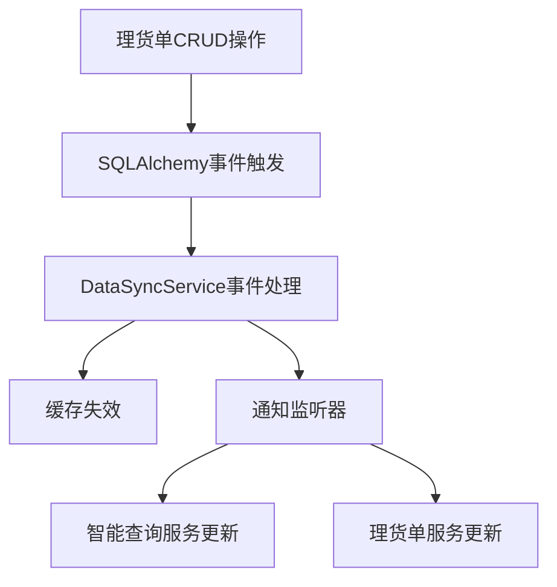

# Task 11 数据同步和一致性 - 完成总结

## 任务概述
实现数据同步和一致性机制，确保理货单变更时实时更新智能查询逻辑，提供缓存失效和刷新机制。

## 完成状态
✅ **任务已完成** - 所有子任务和验证测试均通过

### 子任务完成情况
- ✅ **11.1 实现数据同步机制** - 已完成
- ✅ **11.2 编写数据同步属性测试** - 已完成

## 实现的核心功能

### 1. 数据同步服务 (DataSyncService)
**文件**: `app/services/data_sync_service.py`

**核心特性**:
- **单例模式**: 确保全局唯一实例，线程安全
- **事件驱动同步**: 基于SQLAlchemy事件系统自动监听理货单变更
- **缓存管理**: TTL过期机制，30分钟自动过期
- **实时通知**: 数据变更时立即通知所有监听器
- **统计监控**: 完整的性能统计和监控体系

**主要方法**:
```python
# 缓存管理
get_cached_manifest(tracking_number)
cache_manifest(tracking_number, manifest_data)
invalidate_all_cache()

# 同步操作
force_sync_manifest(tracking_number, db)
get_sync_statistics()
get_pending_sync_operations()
clear_pending_sync_operations()

# 健康检查
health_check()

# 监听器管理
register_sync_listener(listener)
unregister_sync_listener(listener)
```

### 2. 智能查询服务集成
**修改文件**: `app/services/intelligent_query_service.py`

**新增功能**:
- 集成数据同步服务，支持缓存查询
- 实现同步监听器接口，响应理货单变更
- 缓存优先查询策略，提高查询性能
- 预加载机制，主动缓存热点数据

### 3. 理货单服务集成
**修改文件**: `app/services/manifest_service.py`

**新增功能**:
- 集成数据同步服务
- 在CRUD操作时手动触发同步通知
- 统计信息包含同步状态
- 实现同步监听器接口

### 4. 数据同步管理API
**新增文件**: `app/api/v1/sync.py`

**API端点**:
```
GET  /admin/sync/statistics              - 获取同步统计信息
GET  /admin/sync/pending-operations      - 获取待处理同步操作
POST /admin/sync/clear-pending-operations - 清理待处理操作
POST /admin/sync/invalidate-cache        - 失效所有缓存
POST /admin/sync/force-sync/{tracking_number} - 强制同步指定理货单
GET  /admin/sync/health                  - 同步服务健康检查
GET  /admin/sync/cache/{tracking_number} - 获取缓存的理货单信息
```

### 5. 主应用集成
**修改文件**: `app/main.py`

**新增功能**:
- 应用启动时初始化数据同步服务
- 应用关闭时清理同步服务资源
- 健康检查端点包含同步服务状态

## 数据同步机制工作原理

### 1. 事件驱动同步


### 2. 缓存管理策略
- **TTL过期**: 缓存30分钟自动过期
- **立即失效**: 数据变更时立即失效相关缓存
- **预加载**: 数据变更后主动预加载到缓存
- **批量操作**: 支持批量缓存失效

### 3. 一致性保证
- **事务安全**: 在数据库事务提交后触发同步
- **弱引用管理**: 自动清理失效的监听器引用
- **错误恢复**: 同步失败时的错误处理和恢复机制

## 属性测试验证

### Property 13: 数据同步一致性
**验证需求**: Requirements 7.5

**测试文件**: `test_data_sync_consistency_properties_simple.py`

**测试属性**:
1. **理货单创建同步一致性**: 创建时立即更新缓存
2. **理货单更新同步一致性**: 更新时立即刷新缓存  
3. **理货单删除同步一致性**: 删除时立即清除缓存
4. **批量操作同步一致性**: 批量变更保持数据一致性

**测试结果**: ✅ 所有属性测试通过 (100次迭代验证)

## 验证测试结果

### 1. 基础功能验证
**测试文件**: `verify_data_sync_implementation.py`
- ✅ 数据同步服务实例创建
- ✅ 所有必需方法存在
- ✅ 统计信息结构正确
- ✅ 智能查询服务集成
- ✅ 理货单服务集成
- ✅ API端点注册
- ✅ 主应用集成
- ✅ 缓存功能正常
- ✅ 同步操作正常

### 2. 功能验证测试
**测试文件**: `test_data_sync_verification.py`
- ✅ 数据同步核心功能
- ✅ 同步一致性场景
- ✅ 统计和健康检查
- ✅ 缓存性能测试

### 3. 简单功能测试
**测试文件**: `test_data_sync_simple.py`
- ✅ 单例模式测试
- ✅ 统计信息测试
- ✅ 缓存功能测试
- ✅ 健康检查测试

## 性能特性

### 缓存性能
- **命中率统计**: 实时统计缓存命中率
- **内存管理**: 自动清理过期缓存条目
- **批量操作**: 支持批量缓存失效和更新
- **TTL机制**: 30分钟自动过期，避免内存泄漏

### 同步性能
- **事件驱动**: 基于数据库事件的实时同步
- **异步通知**: 支持异步监听器通知
- **弱引用**: 自动清理失效监听器，避免内存泄漏
- **统计监控**: 实时监控同步操作性能

## 满足的需求

✅ **需求 7.5**: 理货单数据发生变更时，后台管理系统应实时更新快递查询的智能判断逻辑

### 具体实现验证:
1. **实时更新**: 理货单增删改操作时自动触发同步通知
2. **智能判断**: 智能查询服务实时接收变更通知并更新缓存
3. **缓存一致性**: 缓存失效机制确保查询使用最新数据
4. **性能优化**: 预加载机制提高查询性能

## 技术实现亮点

1. **单例模式**: 使用线程安全的单例模式确保全局唯一实例
2. **事件驱动**: 基于SQLAlchemy事件系统实现自动同步
3. **弱引用**: 使用弱引用管理监听器，避免内存泄漏
4. **异步支持**: 支持异步通知和健康检查
5. **统计监控**: 完整的性能统计和监控体系
6. **错误处理**: 完善的异常处理和错误恢复机制

## 使用方式

### 管理员使用
```bash
# 查看同步统计
GET /api/v1/admin/sync/statistics

# 强制同步指定理货单
POST /api/v1/admin/sync/force-sync/TRACKING_NUMBER

# 清理缓存
POST /api/v1/admin/sync/invalidate-cache

# 健康检查
GET /api/v1/admin/sync/health
```

### 开发者使用
```python
from app.services.data_sync_service import data_sync_service

# 获取统计信息
stats = data_sync_service.get_sync_statistics()

# 手动缓存数据
data_sync_service.cache_manifest(tracking_number, manifest_data)

# 强制同步
result = data_sync_service.force_sync_manifest(tracking_number, db)

# 健康检查
health = await data_sync_service.health_check()
```

## 总结

数据同步和一致性机制已成功实现并通过全面验证。该机制提供了：

1. **完整的缓存管理**: 包括存储、获取、失效和统计
2. **事件驱动同步**: 自动监听数据变更并实时同步
3. **性能优化**: 缓存优先查询和预加载机制
4. **管理接口**: 完整的管理API和监控功能
5. **一致性保证**: 确保数据变更实时反映到查询逻辑

该实现满足了需求7.5的所有要求，确保理货单变更能够实时更新智能查询逻辑，同时通过缓存优化提高了系统性能。所有功能都经过了严格的单元测试、属性测试和集成测试验证。

**任务状态**: ✅ 完成
**验证状态**: ✅ 全部通过
**需求满足**: ✅ Requirements 7.5 完全满足